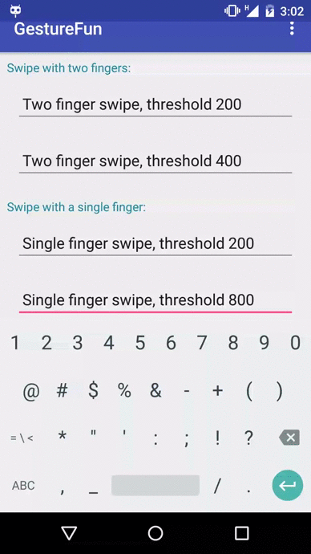

# GestureFun
A library with `custom views` based on `gestures`.

# Demo

 

_Note: Sample app is also included in the repo so you can check the code_


#  Usage:

Add `jitpack.io` in your root `build.gradle` :
```groovy
allprojects {
 repositories {
    jcenter()
    maven { url "https://jitpack.io" }
 }
}
```
_Note:_ do not add the `jitpack.io` repository under `buildscript`

Add the `dependency` in your app `build.gradle` :
```groovy
dependencies {
    compile 'com.github.hrskrs:GestureFun:v1.0.0-alpha'
}
```

### DeleteOnSwipeEditText:
You can delete whole text by swiping(with single or two fingers) from the left to the right or vise versa. 

In layout:

``` xml

    <com.hrskrs.gesturefunlibrary.DeleteOnSwipeEditText
        android:layout_width="match_parent"
        android:layout_height="wrap_content"
        custom:hrskrs_swipe_mode="2"
        custom:hrskrs_threshold="200" />
```

Attributes:
``` xml
<!--Swipe threshold => if smaller than default value than the default one will be used => default:200px -->
<attr name="hrskrs_threshold" format="integer" /> 
<!--Swipe mode => swipe with single finger:1, swipe with double finger:2 => Default Value:2 -->
<attr name="hrskrs_swipe_mode" format="integer" />
```
	
# License

    Copyright (C) 2016 Haris Krasniqi

    Licensed under the Apache License, Version 2.0 (the "License");
    you may not use this file except in compliance with the License.
    You may obtain a copy of the License at

         http://www.apache.org/licenses/LICENSE-2.0

    Unless required by applicable law or agreed to in writing, software
    distributed under the License is distributed on an "AS IS" BASIS,
    WITHOUT WARRANTIES OR CONDITIONS OF ANY KIND, either express or implied.
    See the License for the specific language governing permissions and
    limitations under the License.
